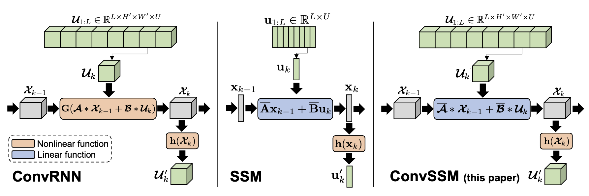

# ConvSSM

COMING SOON!!

This repository provides the official JAX implementation for the
paper:

**Convolutional State Space Models for Long-Range Spatiotemporal Modeling** [[arXiv]](https://arxiv.org/abs/2310.19694) [[OpenReview]](https://openreview.net/forum?id=1ZvEtnrHS1&noteId=1ZvEtnrHS1)

[Jimmy T.H. Smith](https://profiles.stanford.edu/jimmy-smith), 
[Shalini De Mello](https://research.nvidia.com/person/shalini-de-mello),
[Jan Kautz](https://jankautz.com), 
[Scott Linderman](https://profiles.stanford.edu/scott-linderman), 
[Wonmin Byeon](https://wonmin-byeon.github.io/)

Neural Information Processing Systems (NeurIPS), 2023.

---

We introduce an efficient long-range spatiotemporal sequence modeling method, **ConvSSM**. It is parallelizable and overcomes major limitations of the traditional ConvRNN (e.g., vanishing/exploding gradient problems) while providing an unbounded context and fast autoregressive generation compared to Transformers. It performs similarly or better than Transformers/ConvLSTM on long-horizon video prediction tasks, trains up to 3× faster than ConvLSTM, and generates samples up to 400× faster than Transformers. We provide the results for the long-horizon Moving-MNIST generation task and long-range 3D environment benchmarks (DMLab, Minecraft, and Habitat).



---

## Example Video Trajectories
See [here](https://sites.google.com/view/convssm) for randomly sampled video trajectories from the paper.


## Citation
Please use the following when citing our work:
```
@inproceedings{
smith2023convolutional,
title={Convolutional State Space Models for Long-Range Spatiotemporal Modeling},
author={Jimmy T.H. Smith and Shalini De Mello and Jan Kautz and Scott Linderman and Wonmin Byeon},
booktitle={Thirty-seventh Conference on Neural Information Processing Systems},
year={2023},
url={https://openreview.net/forum?id=1ZvEtnrHS1}
}
```

Please reach out if you have any questions.


