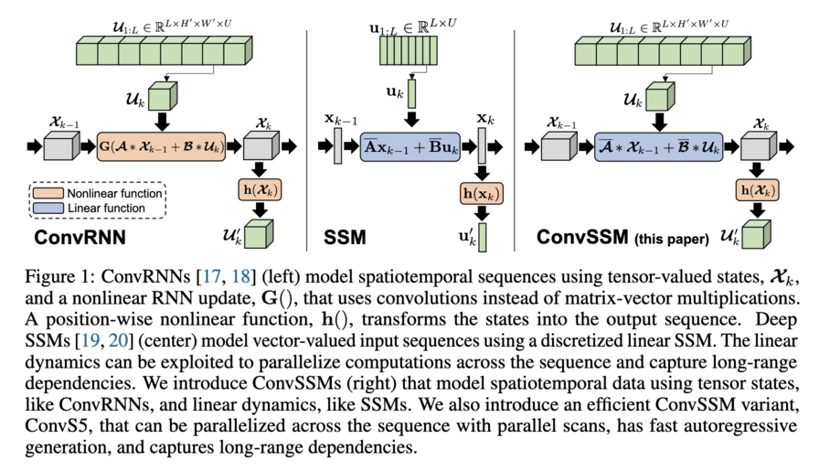

# Convolutional State Space Models for Long-Range Spatiotemporal Modeling

This repository provides the official JAX implementation for the
paper:

**Convolutional State Space Models for Long-Range Spatiotemporal Modeling** [[arXiv]](https://arxiv.org/abs/2310.19694)

[Jimmy T.H. Smith](https://jimmysmith1919.github.io/), 
[Shalini De Mello](https://research.nvidia.com/person/shalini-de-mello),
[Jan Kautz](https://jankautz.com), 
[Scott Linderman](https://web.stanford.edu/~swl1/), 
[Wonmin Byeon](https://wonmin-byeon.github.io/), 
NeurIPS 2023.
 <!-- [[paper]](https://drive.google.com/file/d/1tSZ9Qd4eqiaQdiu_KkhdMgDvYn6UG1Tc/view?usp=sharing) --> 

For business inquiries, please visit the NVIDIA website and submit the form: [NVIDIA Research Licensing](https://www.nvidia.com/en-us/research/inquiries/).

---

We introduce an efficient long-range spatiotemporal sequence modeling method, **ConvSSM**. It is parallelizable and overcomes major limitations of the traditional ConvRNN (e.g., vanishing/exploding gradient problems) while providing an unbounded context and fast autoregressive generation compared to Transformers. It performs similarly or better than Transformers/ConvLSTM on long-horizon video prediction tasks, trains up to 3× faster than ConvLSTM, and generates samples up to 400× faster than Transformers. We provide the results for the long horizon Moving-MNIST generation task and long-range 3D environment benchmarks (DMLab, Minecraft, and Habitat).



The repository builds on the training pipeline from [TECO](https://github.com/wilson1yan/teco). 

---

### Installation
You will need to install JAX following the instructions [here](https://jax.readthedocs.io/en/latest/installation.html).
We used JAX version 0.3.21.
```commandline
pip install --upgrade jax[cuda]==0.3.21 -f https://storage.googleapis.com/jax-releases/jax_cuda_releases.html
```

Then install the rest of the dependencies with:
```commandline
sudo apt-get update && sudo apt-get install -y ffmpeg
pip install -r requirements.txt
pip install -e .
```
<!-- **TODO**: Need to make sure requirements.txt is up to date, need to check specific Jax version and if newer jax versions work, need to check ffmpeg, etc. -->

---

### Datasets
For `Moving-Mnist`:

1) Download the MNIST binary file.
```commandline
wget http://yann.lecun.com/exdb/mnist/train-images-idx3-ubyte.gz -O data/moving-mnist-pytorch/train-images-idx3-ubyte.gz
```
2) Use the script in `data/moving-mnist-pytorch` to generate the Moving MNIST data.

For 3D Environment tasks:

We used the scripts from the [TECO](https://github.com/wilson1yan/teco) repository to download the datasets; [`DMLab`](https://github.com/wilson1yan/teco/blob/master/scripts/download/dmlab.sh) and 
[`Habitat`](https://github.com/wilson1yan/teco/blob/master/scripts/download/habitat.sh). Check the TECO repository for the details of the datasets.
<!-- **TODO**: Not sure if we provide more specific instructions ourselves, or just point them to TECO. -->

The data should be split into 'train' and 'test' folders.

---

### Pretrained VQ-GANs:
Pretrained VQ-GAN checkpoints for each dataset can be found [here](https://drive.google.com/drive/folders/10hAqVjoxte9OxYc7WIih_5OtwbdOxKoi). Note these are also from [TECO](https://github.com/wilson1yan/teco). 

---

### Pretrained ConvS5 checkpoints: 
Pretrained ConvS5 checkpoints for each dataset can be found [here](https://drive.google.com/drive/folders/1-JcF7qch-bz4Eapymw3Uv4OFg-s-URs5?usp=sharing). Download the checkpoints to the checkpoint_directories. 
Default checkpoint_directory: `logs/<output_dir>/checkpoints/`

| dataset | checkpoint | config |
|:---:|:---:|:---:|
| Moving-Mnist 300 | [link](https://drive.google.com/drive/folders/1-qYyPNKK5_wF5RsXUcKO_nzi8jQJ3ok1?usp=sharing)  | `Moving-MNIST/300_train_len/mnist_convS5_novq.yaml` |
| Moving-Mnist 600 | [link](https://drive.google.com/drive/folders/1-h-RVvc6KJuJPaIrFtIbKbolr0cU3_o2?usp=sharing) | `Moving-MNIST/600_train_len/mnist_convS5_novq.yaml` |
| DMLab | [link](https://drive.google.com/drive/folders/1-YfDv2oEY0MqFWGOwHRa5cs5WnjSctk_?usp=sharing) | `3D_ENV_BENCHMARK/dmlab/dmlab_convs5.yaml` |
| Habitat | [link](https://drive.google.com/drive/folders/102ckQjxstpbjqmjW3xG-J6R-fpUhQdW2?usp=sharing) | `3D_ENV_BENCHMARK/habitat/habitat_teco_convS5.yaml`  |
| Minecraft | [link](https://drive.google.com/drive/folders/100RROetFK5lvp6ckgGta-Q3jQPdb0qQP?usp=sharing)  | `3D_ENV_BENCHMARK/minecraft/minecraft_teco_convS5.yaml` |

---

### Training
Before training, you will need to update the paths to the corresponding configs files to point to your dataset and VQ-GAN directories.

To train, run:
`python scripts/train.py -d <dataset_dir> -o <output_dir> -c <path_to_config_yaml>`

Example for training ConvS5 on DMLAB:
```commandline
python scripts/train.py -d datasets/dmlab -o dmlab_convs5 -c configs/3D_ENV_BENCHMARK/dmlab/dmlab_convs5.yaml
```

Note: we only used data parallel training for our experiments. Model parallel training will require implementing JAX [xmap](https://jax.readthedocs.io/en/latest/notebooks/xmap_tutorial.html) or [pjit/jit](https://jax.readthedocs.io/en/latest/jax-101/08-pjit.html). See [this](https://github.com/wilson1yan/teco/tree/master/teco/models/xmap) folder in the TECO repo for an example using xmap. 

Our runs were performed in a multinode NVIDIA V100 32GB GPU environment. 

---

### Evaluation
To evaluate run:
`python scripts/eval.py -d <dataset_dir> -o <output_dir> -c <path_to_eval_config_yaml>`

Example for evaluating ConvS5 on DMLAB:
```commandline
python scripts/eval.py -d datasets/dmlab -o dmlab_convs5 -c configs/3D_ENV_BENCHMARK/dmlab/dmlab_convs5_eval.yaml
```

This will perform the sampling required for computing the different evaluation metrics. The videos will be saved into `npz` files. 

For FVD evaluations run: `python scripts/compute_fvd.py <path_to_npz>`

Example for ConvS5 on DMLAB:
```commandline
python scripts/compute_fvd.py logs/dmlab_convs5/samples_36
```

For PSNR, SSIM, and LPIPS run: `python scripts/compute_metrics.py <path_to_npz>`

Example for ConvS5 on DMLAB:
```commandline
python scripts/compute_metrics.py logs/dmlab_convs5/samples_action_144
```

---

### Citation
Please use the following when citing our work:

```BiBTeX
@inproceedings{
      smith2023convolutional,
      title={Convolutional State Space Models for Long-Range Spatiotemporal Modeling},
      author={Jimmy T.H. Smith and Shalini De Mello and Jan Kautz and Scott Linderman and Wonmin Byeon},
      booktitle={Thirty-seventh Conference on Neural Information Processing Systems},
      year={2023},
      url={https://openreview.net/forum?id=1ZvEtnrHS1}
}
```

---

### License
Copyright (c) 2022-2023 NVIDIA CORPORATION & AFFILIATES. All rights reserved.
See LICENSE file for details.


Please reach out if you have any questions.

-- The ConvS5 authors.